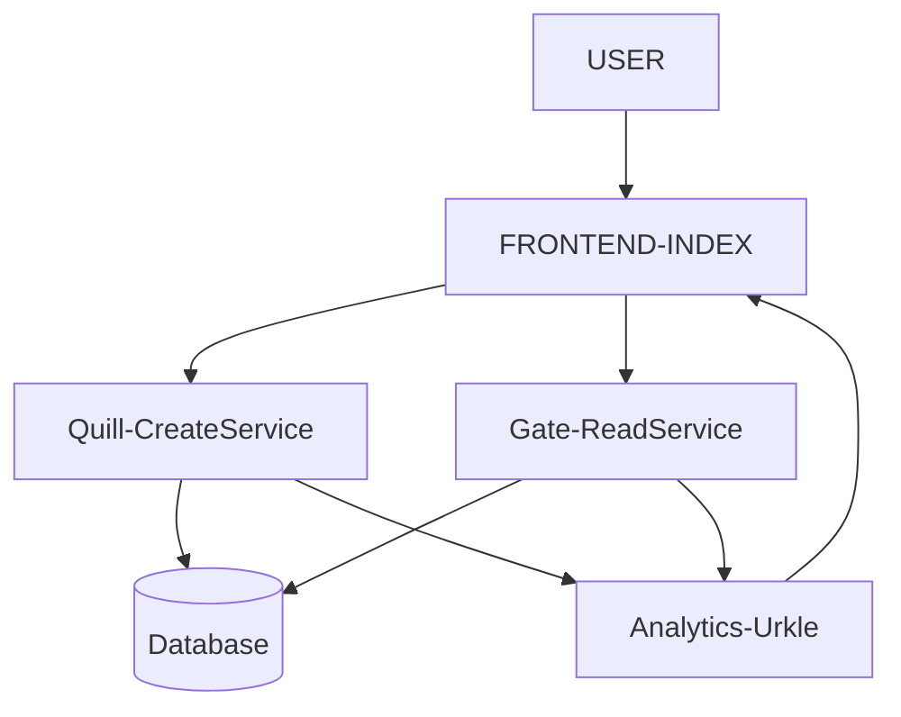
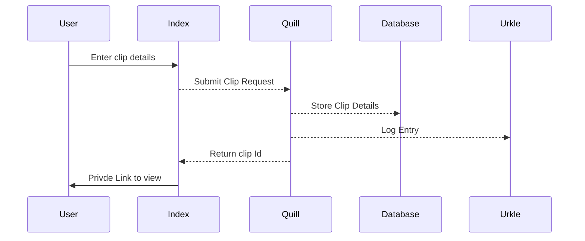
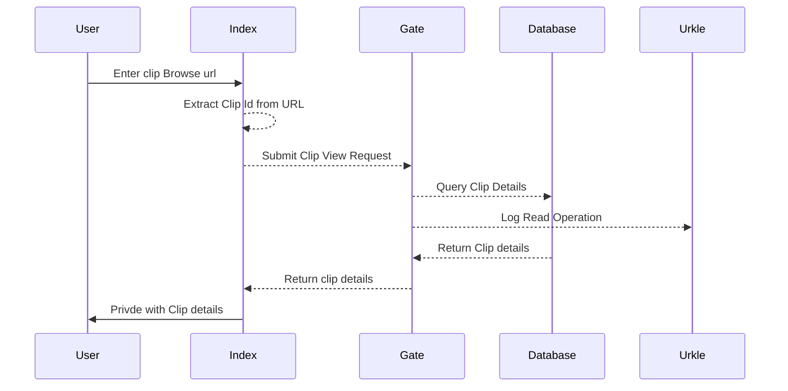

# Clippy
Getting a feel for small microsevivces implementation with GoLang for the Backend and React for the Frontend and Kubernetes Deployment.
Aiming to eventually have an implementation close the PasteBin [system-desgin-primer](https://github.com/donnemartin/system-design-primer/blob/master/solutions/system_design/pastebin/README.md#design-pastebincom-or-bitly) 's example

Clippy is a simple, minimalistic, Web Application to help you share items via your clipboard across all your devices.

##### Folder Structure :
- Index => User Frontend (Completed)
- Quill => Create Clips Service (Completed)
- Gate => Read Service (Completed)
- Urkle => Analytics module

##### Application Workflows:
- Create a clip

- Access a clip
