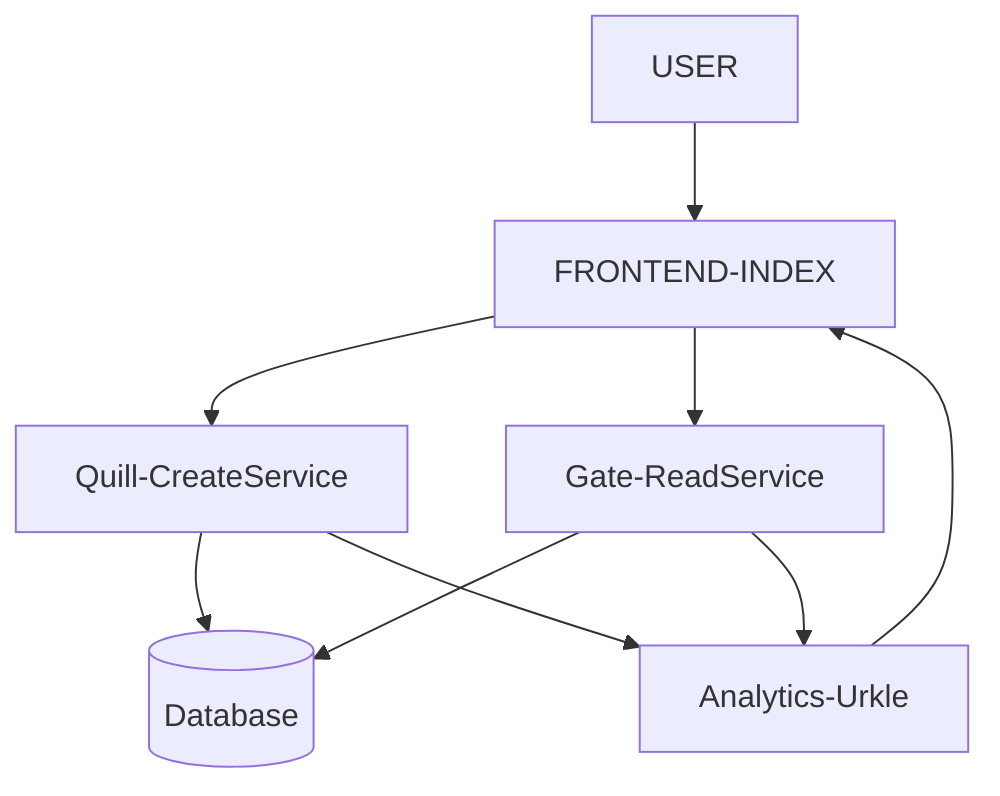

# Clippy
Getting a feel for small microsevivces implementation with GoLang for the Backend and React for the Frontend and Kubernetes Deployment.

Clippy is a simple, minimalistic, Web Application to help you share items via your clipboard across all your devices.

##### Folder Structure :
-  Index => User Frontend (Completed)
-  Quill => Create Clips Service (Completed)
-  Gate => Read Service (Completed)
-  Urkle => Analytics module